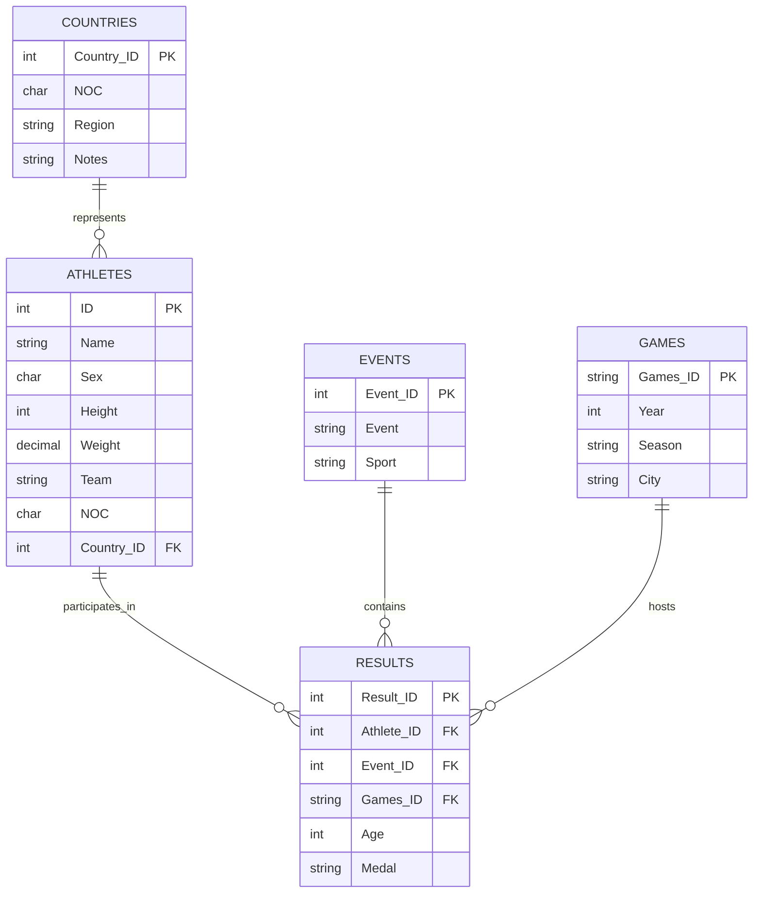

# Olympics History Analysis


Welcome to the **Olympics History** project! This repository hosts a Jupyter notebook that explores the "120 Years of Olympic History - Athletes and Results" dataset, available on GitHub at [https://github.com/Mohamed-Ibrahim20/Olympics-History](https://github.com/Mohamed-Ibrahim20/Olympics-History). Using data analysis and visualizations, this project reveals insights into athlete performances, medal distributions, and trends spanning over a century of Olympic Games.

---

## Dataset Description

The dataset, sourced from [Kaggle](https://www.kaggle.com/datasets/heesoo37/120-years-of-olympic-history-athletes-and-results/data), covers Olympic Games from Athens 1896 to Rio 2016. It includes detailed records of athletes, events, and results organized into five key tables:

- **COUNTRIES**: Country details and National Olympic Committee (NOC) codes.
- **ATHLETES**: Athlete information, including name, gender, height, weight, and team.
- **EVENTS**: Olympic events and their associated sports.
- **GAMES**: Details of each Olympic Games, such as year, season, and host city.
- **RESULTS**: Performance records, including medals won by athletes in specific events.

---

## Database Schema

The dataset's structure is illustrated below with an Entity-Relationship Diagram (ERD) in Mermaid syntax, followed by a visual representation:




*Figure: Visual representation of the database schema.*

---

## Notebook Content

The `Olympics_History.ipynb` notebook offers a range of analyses, including:

- **Medal Counts**: Aggregates medals by country, sport, or athlete.
- **Athlete Insights**: Analyzes distributions of age, height, and weight.
- **Historical Trends**: Visualizes participation and performance changes over time.
- **Event Breakdowns**: Examines the diversity of sports and events in Olympic history.

Each analysis is accompanied by explanations and visualizations for clarity and engagement.

---

## Prerequisites

To run the notebook, you'll need:

- **Python 3.x**
- **Jupyter Notebook** or **JupyterLab**
- Required libraries:
  - `pandas`
  - `numpy`
  - `matplotlib`
  - `seaborn`

Install these with:
```bash
pip install pandas numpy matplotlib seaborn
```

---

## How to Run the Notebook

Follow these steps to set up and run the project:

1. **Download the Dataset**:
   - Get the dataset from [Kaggle](https://www.kaggle.com/datasets/heesoo37/120-years-of-olympic-history-athletes-and-results/data).
   - Place the CSV files in a `data/` directory within the repository.

2. **Clone the Repository**:
   ```bash
   git clone https://github.com/Mohamed-Ibrahim20/Olympics-History.git
   cd Olympics-History
   ```

3. **Install Dependencies**:
   ```bash
   pip install pandas numpy matplotlib seaborn
   ```

4. **Launch Jupyter**:
   ```bash
   jupyter notebook
   ```

5. **Open and Run**:
   - In Jupyter, navigate to `Olympics_History.ipynb`.
   - Run the cells in sequence, ensuring the dataset is in the `data/` directory.

For an online option, upload the notebook to **Google Colab** and adjust the data paths as needed.

---

## Contributing

Contributions are welcome! To contribute:

1. Fork the repository.
2. Create a branch for your changes.
3. Commit your updates with descriptive messages.
4. Push to your fork and submit a pull request.

Please include thorough documentation and follow Python best practices.

---

## Acknowledgments

- **Data Source**: [120 Years of Olympic History - Athletes and Results](https://www.kaggle.com/datasets/heesoo37/120-years-of-olympic-history-athletes-and-results/data) by Heesoo37 on Kaggle.
- **Tools**: Gratitude to the creators of Jupyter, Pandas, Matplotlib, and Seaborn.

---

Enjoy diving into Olympic history with data! For questions or suggestions, feel free to open an issue or reach out.
